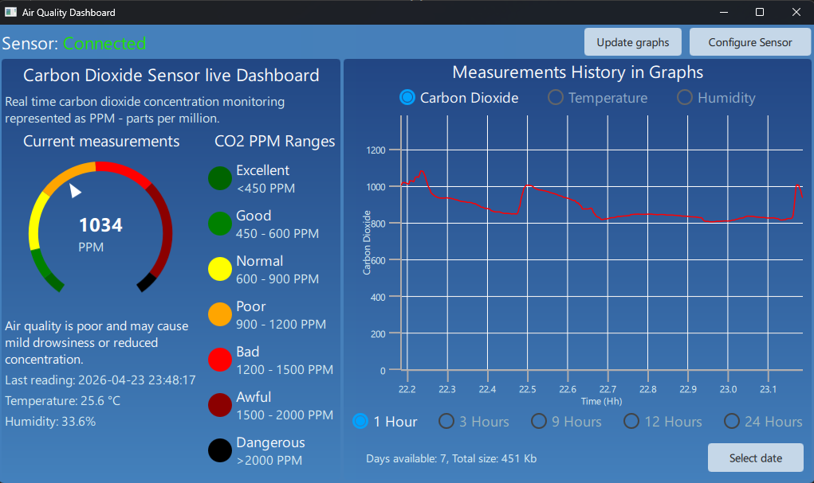
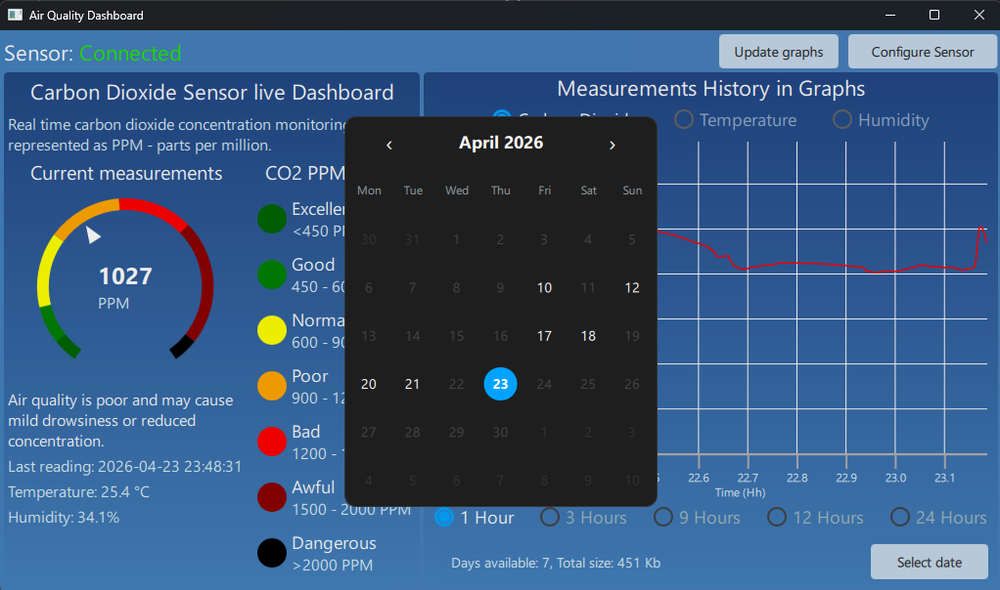
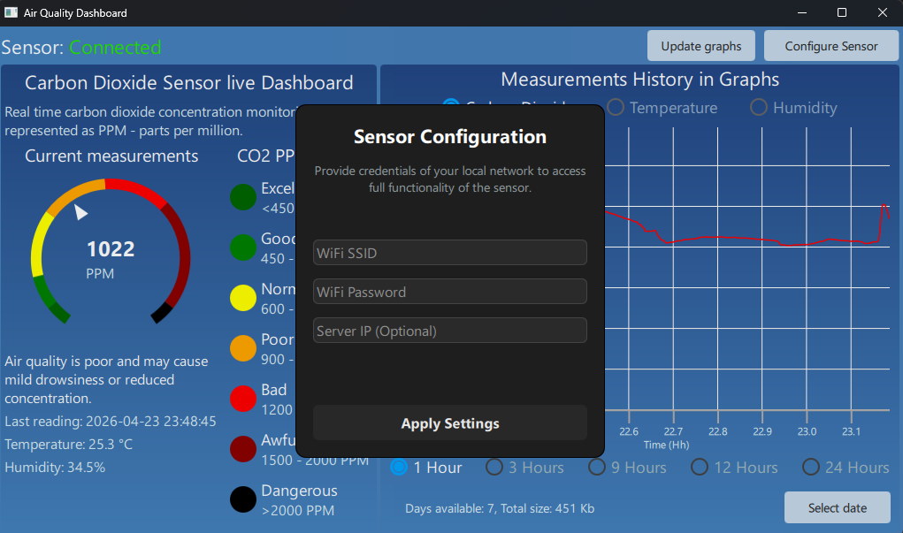

# Air Quality sensor with live dashboard app

The project includes firmware for an esp32 based air quality sensor that measures carbon dioxide concentration as parts-per-millions as well as temperature and humidity. The centralized dashboard enables monitoring of air quality measured by the sensor in real-time as well as measurement history in graphs.

## Firmware features
- High precision carbon dioxide measurements via Sensirion SCD40 sensor
- LCD1602 Display showing running average of most recent measurements
- Circular buffer-like storage on LittleFS to cache measurements when WiFi or server aren't available
- All main firmware routines (sensor polling, display updates, networking, etc) are implemented in FreeRTOS tasks to optimize MCU usage
- Configuration from supporting app on PC via serial

## Dashboard features
- Modern reactive UI written in QML/Qt 6.10
- Asynchronous multithreaded networking with boost::asio
- Live measurements visualization with description of potential health effects of current CO2 level
- Measurements history visualization via QtGraph extension

## Dashboard UI showcase

## Required electronics
- Sensirion SCD40
- ESP32 CH340
- LCD1602 with an I2C adapter
- A push button and wires

## Wiring schema
TODO

## Tech used
- Modern C++20
- FreeRTOS
- boost::asio for asynchronous networking
- QML/Qt 6.10 and QtGraph extension for modern reactive UI
- serial and fmt libraries
- platformio to compile and flash the firmware

## Architecture overview
TODO

## Building and running the project
### Firmware
1. Open `Firmware` directory in VS Code or CLion with **PlatformIO** extension enabled.
2. Make sure your ESP32 board variation matches `esp32doit-devkit-v1` or change `board` field in `platformio.ini` file.
3. Connect your ESP32 via USB.
4. Click **Upload** to compile and flash.

### Dashboard
1. Ensure **Qt 6.10** with support for **QML** and **QtGraphs** is installed.
2. Open `Dashboard` directory in **QtCreator** and select a suitable kit.
3. Configure `CMakeLists.txt` if needed, then press **Build and Run**